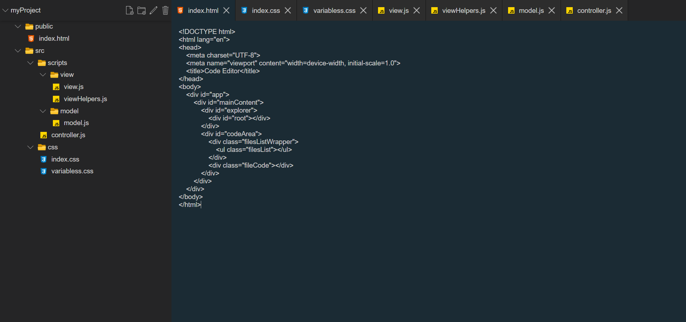

# codeEditor

link - https://arshak-grigoryan.github.io/codeEditor/  



## Tech

* [Webpack](https://webpack.js.org/) - open-source JavaScript module bundler
* [ESLint](https://eslint.org/) - static code analysis tool for identifying problematic patterns found in JavaScript code
* [Prettier](https://prettier.io/) - opinionated code formatter

## Usage

codeEditor requires [node.js](https://nodejs.org/) to run.

### Installation

Install the dependencies

```sh
$ npm install
```

### Serve

To serve in the browser - Runs webpack-dev-server

```sh
$ npm start
```

### Dev

Run application in development mode

```sh
$ npm run dev
```

### Watch

Watch application in development mode

```sh
$ npm run watch
```

### Build

Compile and build

```sh
$ npm run build
```
